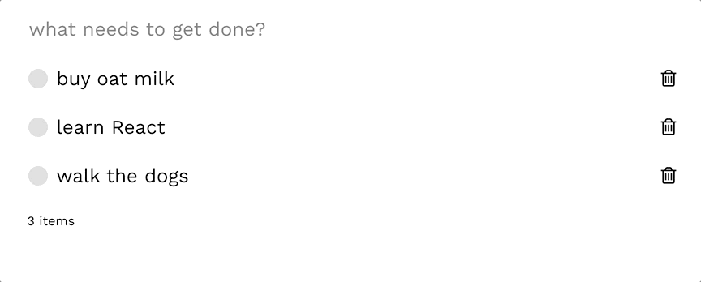

# todo-app-react
To Do Application in React
### Date: March 29 2021

## What I did
I created a basic To Do app in React following a tutorial by Enlight (https://enlight.nyc/projects/react-to-do-list) and after completing the Scrimba Learn React course (https://scrimba.com/learn/learnreact)
  After the Scrimba course, I wanted to continue learning React by creating a real-life practical application. I decided to start with the basic to do app. This would be a great way for me to review what I learned from the course and further my understanding of useState() with some guidance.

## What I learned:
- Through this tutorial, I developed a better understanding of useState()
- I also used this as an opportunity to continue playing around with the styles to add my own unique 'flair' (ex. added fonts and used FontAwesome)
- by adding local storage, I furthered my understanding of useEffect()

## Next Steps
- [X] As a challenge, I will be implementing **local storage** (so that the data persists) using my own knowledge and scouring the Internet :) 
- I will either start another Scrimba React course or create another small-scale React application :)

## Work Log
I was able to successfully implement **local storage** 'on my own'! I had some help following the logic from this tutorial: https://www.youtube.com/watch?v=uRDujdtVfJs 
